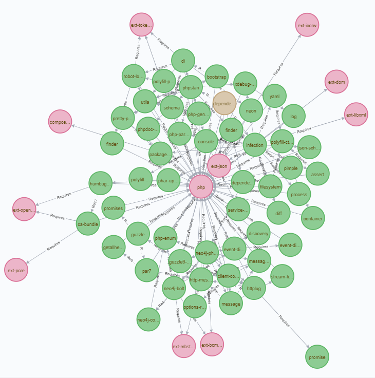

# Dependency Visualiser

With any modern PHP project, the number of dependencies can grow
almost exponentially. Keeping track can be a difficult task,
especially when those dependencies have a large number of sub
dependencies.

For example this package has the following explicit dependencies:

* php
* ext-json (php extension)
* phpstan/phpstan (dev)
* infection/infection (dev)
* rockprofile/dependency-visualiser-neo4j (dev)

however, after composer does its thing the dependencies grows:

From 5 explicit dependencies, when considering a dev environment
we now have 65 dependencies ranging from composer packages, PHP
extensions and the language itself.

Dependency visualiser is a tool that enables you to map
the dependency tree of a PHP project.

## Requirements

The package currently reads each composer file. It will adhere 
to the vendor-dir parameter of the composer file.

A basic storage engine for Neo4j exists on composer
(rockprofile/dependency-visualiser-neo4j). As long as 
StorageInterface is implemented you can use any storage.

## Current Limitations

The biggest current limitation is that the script does not identify if
there are conflicting required package versions. Although composer
should complain if this does occur it would be handy for the script to 
identify this also.

It would also be good for the script to identify the minimum version
required for each dependency in the event that multiple sub dependencies
require the same package.

## To Do
* Identify the minimum available version of a dependency.
* Implement a parser for other package managers such as NPM (for JS).
* Implement output scripts.
* Modify the package to use the lock file if available falling back to
individual files if necessary.